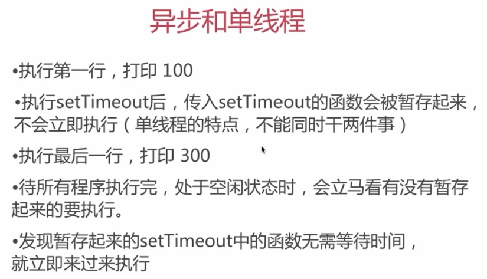
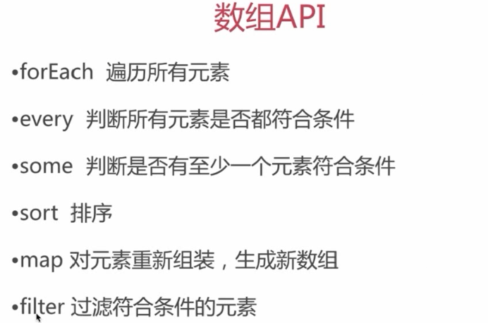
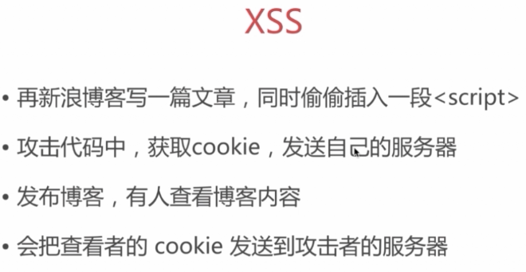
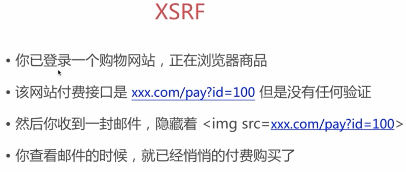

# 前端跨域解决方案CORS、JSONP的区别
```
CORS: IE10以上，支持任何请求，分为简单请求和非简单请求
对于简单请求，浏览器直接发出CORS请求。具体来说，就是在头信息之中，增加一个Origin字段。Origin字段用来说明，本次请求来自哪个源（协议 + 域名 + 端口）。服务器根据这个值，决定是否同意这次请求。
非简单请求是那种对服务器有特殊要求的请求，比如请求方法是PUT或DELETE，或者Content-Type字段的类型是application/json。"预检"请求用的请求方法是OPTIONS，表示这个请求是用来询问的。

JSONP: 任何浏览器，但是只支持GET请求
```

# postMessagej解决跨域、跨窗口消息传值
postMessage(data,origin)
1. 页面和其打开的新窗口的数据传递
2. 多窗口之间消息传递
3. 页面与嵌套的iframe消息传递

# Webpack
```
entry: 用来写入口文件，它将是整个依赖关系的根
output: 即使入口文件有多个，但是只有一个输出配置
module {} > rules [] > loader:  通过使用不同的Loader，我们能够调用外部的脚本或者工具，实现对不同格式文件的处理
plugins {}: 可以通过插件对整个项目进行处理，例如：
new webpack.HotModuleReplacementPlugin(),  热更新
new HtmlWebpackPlugin({
  inject: true,
  template: paths.appHtml,
}),                                        根据一个index.html,生成一个自动引用你打包后的js文件的新index.html    
```

# http状态码
```
200（成功）  服务器已成功处理了请求。通常，这表示服务器提供了请求的网页。
400（错误请求） 服务器不理解请求的语法。 
401（身份验证错误） 此页要求授权。您可能不希望将此网页纳入索引。 
403（禁止） 服务器拒绝请求。
404（未找到） 服务器找不到请求的网页。例如，对于服务器上不存在的网页经常会返回此代码。
405（方法禁用） 禁用请求中指定的方法。
413（请求实体过大） 服务器无法处理请求，因为请求实体过大，超出服务器的处理能力。
414（请求的 URI 过长） 请求的 URI（通常为网址）过长，服务器无法处理。 
500（服务器内部错误）  服务器遇到错误，无法完成请求。 
501（尚未实施） 服务器不具备完成请求的功能。例如，当服务器无法识别请求方法时，服务器可能会返回此代码。 
503（服务不可用） 目前无法使用服务器（由于超载或进行停机维护）。通常，这只是一种暂时的状态。
504（网关超时）  服务器作为网关或代理，未及时从上游服务器接收请求。 
505（HTTP 版本不受支持） 服务器不支持请求中所使用的 HTTP 协议版本。 
```

# 获取页面元素位置与宽高
```
1. element.clientWidth = content + padding
2. element.clientHeight = content + padding
```

# js 统计一个字符串出现频率最高的字母/数字
```
let str = 'dasdsadwxzdsadsd';
const strChar = str => {
  let strArr = [...str];
  let maxValue = '';
  let max = 0;
  let obj = {};
  strArr.forEach(item => {
    obj[item] = obj[item] == null ? obj[item]++ : 1;
    if (obj[item] > max) {
      max = obj[item];
      maxValue = item;
    }
  });
  return maxValue;
}
```

# js数组及对象的深浅拷贝
1. 浅拷贝,可以通过slice或者concat方法直接实现。
```
var arr1 = [1, 2, 3];
var arr2 = arr1.slice(0);
arr1[0] = 0;
console.log(arr1);                  //  [0, 2 ,3]
console.log(arr2);                  //  [1, 2, 3]

var arr3 = [1, 2, 3];
var arr4 = arr3.concat();
arr3[0] = 0;
console.log(arr3);                  //  [0, 2, 3]
console.log(arr4);                  //  [1, 2, 3]
```
2. 深拷贝
```
var deepCopy = function(o) {
  var n = [];
  if (o instanceof Array) {
    for (var i = 0; i < o.length; i++) {
      n[i] = deepCopy(o[i]);
    }
    return n;
  } else if (o instanceof Object) {
    var n = {};
    for (var i in o) {
      n[i] = deepCopy(o[i]);
    }
    return n;
  } else {
    return n;
  }
}
```

# css3 伪类写法中：和：：的区别
```
单冒号叫伪类是css2的写法，要求低版本兼容时可以用这个写法，双冒号叫伪元素是css3新写法，兼容主流浏览器；
1. 伪类用于向某些选择器添加特殊的效果。
2. 伪元素用于将特殊的效果添加到某些选择器。
```

# href和src区别
```
href 表示超文本引用，在 link和a 等元素上使用。src 表示来源地址，在 img、script、iframe 等元素上
```

# title和alt的区别
```
alt属性只能用在img、area和input元素中，用于网页中图片无法正常显示时给用户提供文字说明使其了解图像信息，alt是替代图像作用而不是提供额外说明文字的。
title可以为元素提供额外说明信息。
```

# css3中的BFC,IFC,GFC和FFC
```
BFC: BFC(Block Formatting Contexts)直译为"块级格式化上下文"。Block Formatting Contexts就是页面上的一个隔离的渲染区域，容器里面的子元素不会在布局上影响到外面的元素，反之也是如此。如何产生BFC？
float的值不为none。
overflow的值不为visible。
position的值不为relative和static。
display的值为table-cell, table-caption, inline-block中的任何一个。
那BFC一般有什么用呢？比如常见的多栏布局，结合块级别元素浮动，里面的元素则是在一个相对隔离的环境里运行。

IFC: IFC(Inline Formatting Contexts)直译为"内联格式化上下文"，IFC的line box（线框）高度由其包含行内元素中最高的实际高度计算而来（不受到竖直方向的padding/margin影响)
IFC中的line box一般左右都贴紧整个IFC，但是会因为float元素而扰乱。float元素会位于IFC与与line box之间，使得line box宽度缩短。 同个ifc下的多个line box高度会不同。 IFC中时不可能有块级元素的，当插入块级元素时（如p中插入div）会产生两个匿名块与div分隔开，即产生两个IFC，每个IFC对外表现为块级元素，与div垂直排列。
那么IFC一般有什么用呢？
水平居中：当一个块要在环境中水平居中时，设置其为inline-block则会在外层产生IFC，通过text-align则可以使其水平居中。
垂直居中：创建一个IFC，用其中一个元素撑开父元素的高度，然后设置其vertical-align:middle，其他行内元素则可以在此父元素下垂直居中。

GFC: GFC(GridLayout Formatting Contexts)直译为"网格布局格式化上下文"，当为一个元素设置display值为grid的时候，此元素将会获得一个独立的渲染区域，我们可以通过在网格容器（grid container）上定义网格定义行（grid definition rows）和网格定义列（grid definition columns）属性各在网格项目（grid item）上定义网格行（grid row）和网格列（grid columns）为每一个网格项目（grid item）定义位置和空间。
那么GFC有什么用呢，和table又有什么区别呢？首先同样是一个二维的表格，但GridLayout会有更加丰富的属性来控制行列，控制对齐以及更为精细的渲染语义和控制。

FFC: FFC(Flex Formatting Contexts)直译为"自适应格式化上下文"，display值为flex或者inline-flex的元素将会生成自适应容器（flex container），可惜这个牛逼的属性只有谷歌和火狐支持，不过在移动端也足够了，至少safari和chrome还是OK的，毕竟这俩在移动端才是王道。
Flex Box 由伸缩容器和伸缩项目组成。通过设置元素的 display 属性为 flex 或 inline-flex 可以得到一个伸缩容器。设置为 flex 的容器被渲染为一个块级元素，而设置为 inline-flex 的容器则渲染为一个行内元素。
伸缩容器中的每一个子元素都是一个伸缩项目。伸缩项目可以是任意数量的。伸缩容器外和伸缩项目内的一切元素都不受影响。简单地说，Flexbox 定义了伸缩容器内伸缩项目该如何布局。
```

# box-sizing
```
box-sizing 属性允许您以特定的方式定义匹配某个区域的特定元素。
例如，假如您需要并排放置两个带边框的框，可通过将 box-sizing 设置为 "border-box"。这可令浏览器呈现出带有指定宽度和高度的框，并把边框和内边距放入框中。
box-sizing: content-box|border-box|inherit;
```

# 懒加载的原理及实现
```
原理：先将img标签中的src链接设为同一张图片（空白图片），将其真正的图片地址存储再img标签的自定义属性中（比如data-src）。当js监听到该图片元素进入可视窗口时，即将自定义属性中的地址存储到src属性中，达到懒加载的效果。
这样做能防止页面一次性向服务器响应大量请求导致服务器响应慢，页面卡顿或崩溃等问题。
1. 既然懒加载的原理是基于判断元素是否出现在窗口可视范围内，首先我们写一个函数判断元素是否出现在可视范围内：
function isVisible($node){
    var winH = $(window).height(),
        scrollTop = $(window).scrollTop(),
        offSetTop = $(window).offSet().top;
    if (offSetTop < winH + scrollTop) {
        return true;
    } else {
        return false;
    }
}
2. 再添加上浏览器的事件监听函数，让浏览器每次滚动就检查元素是否出现在窗口可视范围内：
$(window).on("scroll", function{
    if (isVisible($node)){
        console.log(true);
    }
})
3. 我们已经很接近了，现在我们要做的是，让元素只在第一次被检查到时打印true，之后就不再打印了
var hasShowed = false;
$(window).on("sroll",function{
    if (hasShowed) {
        return;
    } else {
        if (isVisible($node)) {
            hasShowed = !hasShowed;
            console.log(true);
        }
    }
})
```

# mvvm和mvc区别？
```
在MVVM架构下，View 和 Model 之间并没有直接的联系，而是通过ViewModel进行交互，Model 和 ViewModel 之间的交互是双向的， 因此View 数据的变化会同步到Model中，而Model 数据的变化也会立即反应到View 上。
ViewModel 通过双向数据绑定把 View 层和 Model 层连接了起来，而View 和 Model 之间的同步工作完全是自动的，无需人为干涉，因此开发者只需关注业务逻辑，不需要手动操作DOM, 不需要关注数据状态的同步问题，复杂的数据状态维护完全由 MVVM 来统一管理。
```

# 标准盒子模型和IE盒子模型
```
标准 W3C 盒子模型的范围包括 margin、border、padding、content，并且 content 部分不包含其他部分。
IE 盒子模型的范围也包括 margin、border、padding、content，和标准 W3C 盒子模型不同的是：IE 盒子模型的 content 部分包含了 border 和 pading。
```

# 数据双向绑定单向绑定优缺点
```
双向绑定是自动管理状态的，对处理有用户交互的场景非常合适，代码量少，当项目越来越大的时候，调试也变得越来越复杂，难以跟踪问题。

单向绑定是无状态的, 程序调试相对容易, 可以避免程序复杂度上升时产生的各种问题, 当然写代码时就没有双向绑定那么爽了。
```

# typeof返回的数据类型？（考察js变量类型）
```
值类型：number、string、boolean、undefined  
引用类型：object（{}、[]、null）、function  
number、string、boolean、object、function、undefined
```
# 何时使用=== 何时使用==？（强制类型转换）
```
obj.a == null 相当于 obj.a === null || obj.a === undefined. 这是jquery源码中推荐的写法
```
# JS中有哪些内置函数？ （数据封装类对象）
```
Object、Array、Boolean、Number、String、Function、Date、RegExp（正则表达式）、Error
```
# JS变量按照存储方式区分为哪些类型，并描述其特点
```
值类型  
var a = 10  
var b = a   
a = 11  
console.log(b)          // 10  

引用类型  
var obj1 = {x: 100}  
var obj2 = obj1  
obj1.x = 200  
console.log(obj2.x)     // 200
```
# 如何理解JSON
```
JSON只不过是一个JS 对象而已  
JSON.stringify({a: 10})  
JSON.parse('{a: 10}')
```
# 用JS创建10个 \<li\> 标签，点击的时候弹出来对应的序号？ （作用域）
```
var i  
for (i = 0; i < 10; i++) {  
  (function (i) {  
    var a = document.createElement('li')  
    a.addEventListener('click', function (e) {  
      e,perventDefault()  
      alert(i)  
    })  
  })(i) 
}
```

# 快排
```
const FastArr = (arr) => {
  if (arr.length < 1) return arr
  let median = Math.floor(arr.length / 2)
  let medianVal = arr.splice(median, 1)[0]
  let left = []
  let right = []
  for (let i = 0; i < arr.length; i++) {
    if (arr[i] < median) {
      left.push(arr[i])
    } else {
      right.push(arr[i])
    }
  }
  return FastArr(left).concat(median, FastArr(right))
}
```

# 路由实现
1. location.hash+hashchange
2. history.pushState()+popState

# 实现数组的随机排序 （JS基础算法）
```
//  利用Math.random() 返回 0 ~ 1之间的随机数  
function randomSort (a, b) {  
  return Math.random() > 0.5 ? -1 : 1  
}  
var arr = [1, 2, 3, 4, 5, 6]  
arr.sort(randomSort)
```
# 构造函数 (构造函数首字母要大写规范)
```
function Foo (name, age) {  
  this.name = name  
  this.age = age  
//  return this  // 默认有这一行  

}  
var f = new Foo('achen', 22)
```
# 构造函数-扩展
```
var a = {} 其实是 var a = new Object() 的语法糖  
var a = [] 其实是 var a = new Array() 的语法糖  
function Foo(){...} 其实是 var Foo = new Function(...)  
使用 instanceof 判断一个函数是否是一个变量的构造函数
```
# 原型规则和示例
```
1.所有的引用类型（数组、对象、函数）,都具有对象特性，即可自由扩展属性  
var obj = {}  obj.a = 100  
function fn() {}  fn.a = 100  
2.所有的引用类型（数组、对象、函数）,都有一个__proto__属性,属性值是一个普通的对象  
console.log(obj.__proto__)  
console.log(fn.__proto__)
3.所有的函数, 都有一个prototype属性，属性值也是普通的对象  
console.log(fn.prototype)  
4.所有的引用类型（数组、对象、函数）,__proto__属性值指向它的构造函数的"prototype"属性值  
console.log(obj.__proto__ === Object.prototype)  
console.log(fn.__proto__ === Function.prototype)  
5.当试图得到一个对象的某个属性时, 如果这个对象本身没有这个属性, 那么会去它的__proto__即它的构造函数的prototype中寻找  
```
//  构造函数  
```  
function Foo(name, age) {  
  this.name = name  
}  
Foo.prototype.alertName = function () {  
  alert(this.name)  
}  
//  创建示例  
var f = new Foo('achen')  
f.printName = function () {  
  console.log(this.name)  
}  
//  测试  
f.printName()  
f.alertName()   //  显示原型中没有会去隐示原型中去寻找  
f.toString()    //  要去 f.__proto__.__proto__ 中查找
```
## 循环对象自身的属性
```
var item  
for (item in f) {  
  //  高级浏览器已经在 for in 中屏蔽了来自原型的属性  
  //  但是这里建议还是加上这个判断，保证程序的健壮性  
  if (f.hasOwnProperty(item)) {  
    console.log(item)  
  }  
}
```
# 原型链
  

# 如何准确判断一个变量是数组类型
arr instanceof Array

# 写一个原型链继承的例子
```
function Elem (id) {  
  this.elem = document.getElementById(id)  
}  
  
Elem.prototype.html = function (val) {  
  var elem = this.elem  
  if(val) {  
    elem.innerHTML = val  
    return this  // 链式操作
  } else {  
    return elem.innerHTML  
  }
}  

Elem.prototype.on = function (type, fn) {  
  var elem = this.elem  
  elem.addEventListener(type, fn)  
  return this
}

var div1 = new Elem('div1')
div1.html('<p>achen</p>').on('click', function() {  
  alert('clicked')  
}).html('<p>javascript</p>')
```
# 描述new 一个对象的过程
**1.创建一个新对象**  
**2.this指向这个新对象**  
**3.执行代码，即对this赋值**  
**4.返回this**  


# 说一下对变量提升的理解
函数声明和函数表达式、变量提升

# 说明this几种不同的使用场景
**1.this要在执行时才能确认值，定义时无法确认**  
```
var a = {  
  name: 'A',  
  fn: function () {  
    console.log(this.name)  
  }
} 
a.fn()      // this === a  
a.fn.call({name: 'B'}, options)  //  this === {name: 'B'}  
var fn1 = a.fn  
fn1()   //  this === window
```
**作为构造函数执行**  
**作为对象属性执行**  
**作为普通函数执行**  
**call apply bind**  

# 如何理解作用域
**1.无块级作用域**  
```
if (true) {  
  var name = 'achen'  
}  
console.log(name)
```
**2.函数和全局作用域**
```
var a = 100  
function fn () {  
  var a = 200  
  console.log('fn', a)  
}  
console.log('global', a)  
fn()  
```
# 实际开发中闭包的应用 （用于封装变量，收敛权限）
```
function isFirstLoad () {  
  var _list = []  
  return function (id) {  
    if (_list.indexOf(id) >= 0) {  
      return false  
    } else {  
      _list.push(id)  
      retun true  
    }  
  }  
}  
var firstLoad = isFirstLoad()  
firstLoad(10)   //  true  
firstLoad(10)   //  false  
firstLoad(20)   //  true  
```
# 同步和异步的区别是什么？ 分别举一个同步和异步的例子
### 区别
**1. 同步会阻塞代码执行，而异步不会**  
**2. alert是同步，setTimeout是异步**
  
**异步不会阻塞程序的运行**
//  异步例子
```
console.log(100)  
setTimeout(() => {  
  console.log(200)  
}, 1000)  
console.log(300)
```
//  同步例子
```
console.log(100)  
alert(200)  
console.log(300)  
```
# 一个关于 setTimeout 的笔试题
```
console.log(1)  
setTimeout(function () {  
  console.log(2)  
}, 0)  
console.log(3)  
setTimeout(function () {  
  console.log(4)  
}, 1000)  
console.log(5)    
```
答案： 1, 3, 5, 2, 4  

# 前端使用异步的场景有哪些
**1.定时任务：setTimeout、setInverval**  
**2.网络请求：ajax请求、动态\加载**  
**3.事件绑定**  

# Date 类型的方法
  

# Array 类型的方法
  
```
var arr = [1, 2, 3] 
arr.forEach((item, index) => {  
  console.log(index, item)  
}) 
arr.every((item, index) => {  
  if (item < 4) {  
    return true  
  }    
}) 
arr.some((item, index) => {  
  if (item < 4) {  
    return true  
  } 
}) 
arr.sort((a, b) => {  
  //    从小到大排序
  return a - b
})
arr.map((item, index) => {  
  return' + item + '|' + index + '</b>'
}) 
//  ['<b>1|0</b>', '<b>2|1</b>', '<b>3|2</b>']
arr.filter((item, index) => {  
  if (item >= 2) {  
    return true  
  }    
})  
//  [2, 3]
```
# 获取 2017-06-10 格式的日期
  

# 获取一个随机数，要求是长度一直的字符串格式
var random = Math.random()  
var random = random + '00000'   //  后面加上5个零  
var random = random.slice(0, 5) //  字符串截取  
console.log(random)  

# 写一个能遍历对象和数组的通用 forEach 函数
```
function forEach (obj, fn) {  
  var key  
  if (obj instanceof Array) {  
    //  准确判断是不是数组
    obj.forEach((item, index) => {  
      fn(item, index)  
    })  
  } else {  
    //  不是数组就是对象  
    for (key in obj) {  
      fn(obj[key], key)  
    }  
  }
}  
var arr = [1, ,2 ,3]  
forEach(arr, (item, index) => {  
  console.log(item, index)  
})  
var obj = {x: 100, y: 200}  
forEach(obj, (value, key) => {  
  console.log(value, key)  
})
```
# DOM操作的常用API有哪些
**1. 获取DOM节点，以及节点的property和Attribute**  
**2. 获取父节点，获取子节点**  
>>childNodes  //得到s的全部子节点  
>>parentNode   //得到s的父节点  
>>nextSbiling   //获得s的下一个兄弟节点  
>>previousSbiling  //得到s的上一个兄弟节点  
>>firstChild   //获得s的第一个子节点  
>>lastChile   //获得s的最后一个子节点  

**3. 新增节点，删除节点**
>>appendChild  
>>removeChild  

# DOM节点的attr和property有何区别  
**1. property 只是一个JS对象的属性的修改**  
**2. Attribute 是对HTML标签属性的修改**  

# BOM
**1. navigator浏览器属性**    
var ua = navigator.userAgent  
var isChrome = ua.indexOf('Chrome')  
console.log(isChrome)

**2. screen屏幕属性**  
console.log(screen.width)

**3. location、URL属性**  
console.log(location.href)  
console.log(location.protocol)  //  'http:' 'https:'  
console.log(location.pathname)  //  '/learn/199'  
console.log(location.search)    //  '?a=1&b=2'  
console.log(location.hash)      //  '#/sasa'  

**4. history历史记录**  
history.back()      //  返回  
history.forward()   //  前进

# 编写一个通用的事件绑定函数


# on事件的原理实现
**事件委托的优点：**  
1.在页面dom元素较多的情况下，大大减少了dom操作，优化了性能；  
2.值需要为一个父元素绑定事件，就可以管理他下面的所有子元素；  

# 数组去重
```
var arr = [1, 2, 3, 4, 1, 2, 3, 4];
[...new Set(arr)];

let obj = {};
arr.forEach(val => {
  obj[val] = 1;
})
Object.keys(obj);

const unique = arr => {
  return arr.filter((ele, index, array) => {
    return index === array.indexOf(ele)
  })
}
```

# 简述事件冒泡流程
1. DOM树形结构
2. 事件冒泡
3. 阻止冒泡
4. 代理

# 无限下拉加载图片的页面，绑定事件
1. 使用代理
2. 知道代理的两个优势

# CommonJS
**nodeJs 模块化规范，现在被大量用于前端，原因：**  
**1. 前端开发依赖的插件和库，都可以从npm中获取**    
**2. 构建工具的高度自动化，使得使用npm的成本非常低**  
**3. CommonJS 不会异步加载JS，而是同步一次性加载出来**  

# 从输入url到得到html的详细过程
**1. 输入域名之后，浏览器根据DNS服务器得到域名的IP地址**  
**2. 向这个IP的机器发送http请求**  
**3. 服务器收到、处理并返回http请求**  
**4. 浏览器得到返回内容**  

# window.onload 和 DOMContentLoaded 的区别
```
window.addEventListener('load', () => {  
  // 页面的全部资源加载完才会执行，包括图片、视频等  
})  
document.addEventListener('DOMContentLoaded', () => {  
  // DOM 渲染完即可执行，此时图片、视频可能还没加载完  
})
```
# 前端安全
    

>>### 解决方案
>>1. 前端替换关键字，例如 \< 为 \&lt; \> 为 \&gt;  
>>2. 后端替换  

  

>>### 解决方案
>>1. 增加验证流程，如输入指纹、密码、短信验证码


# Vue
1. 生命周期
```
beforeCreate: type(func) 在实例初始化之后，数据观测(data observer) 和 event/watcher 事件配置之前被调用。

created: type(func) 实例已经创建完成之后被调用。

beforeMount: type(func) 在挂载开始之前被调用：相关的 render 函数首次被调用。 该钩子在服务器端渲染期间不被调用。

methods: type(func) 

updated: type(func) 由于数据更改导致的虚拟 DOM 重新渲染和打补丁，在这之后会调用该钩子。

beforeDestroyed: type(func) Vue 实例销毁之前调用。

destroyed: type(func) Vue 实例销毁后调用。

```

2. vue-router
```
router的构造配置：
1. mode                     路由模式，默认hash
2. base                     应用的基路径
3. linkActiveClass          全局配置 <router-link> 激活时的类名
4. 
全局导航守卫： 
router.beforeEach((to, from, next) => {
  if (to.matched.some(record => record.meta.requiresAuth)) {
    // this route requires auth, check if logged in
    // if not, redirect to login page.
    if (!auth.loggedIn()) {
      next({
        path: '/login',
        query: { redirect: to.fullPath }
      })
    } else {
      next()
    }
  } else {
    next() // 确保一定要调用 next()
  }
})
```

3. vuex

# react
1. 生命周期（常用钩子函数）  
```
getInitalState () {
  //  初始化组件state, es6写法使用
  constructor(props, context) {
    super(props, context)
    this.state = {}
  }
}

componentWillMount () {
  //  render 之前执行
}

componentDidmount () {
  //  render 之后执行  ajax等操作
}

componentWillReceiveProps () {
  //  props是父组件传递给子组件的。父组件发生render的时候子组件就会调用componentWillReceiveProps（不管props有没有更新，也不管父子组件之间有没有数据交换）。
}

shouldComponentUpdate (nextProps, nextState) {
  //  用于性能优化
  //  每次调用setState后都会调用shouldComponentUpdate,判断是否需要重新渲染组件。默认返回true，需要重新render。
  return true
}

componentDidUpdate(prevProps, prevState) {
  //  触发更新完成
  //  除了首次render之后调用componentDidMount，其它render结束之后都是调用componentDidUpdate。
  //  ajax
}

componentWillUnmount () {
  //  清空定时器
}
```
2. 智能组件和木偶组件
```
智能组件：单独的组件,用于管理数据和规则
木偶组件：公共组件,不管数据和规则,之用于展示数据
```
3. react性能优化
```
性能检测
import Perf from 'react-addons-perf'
if (__DEV__) {
  window.Perf = Perf
}

PureRenderMixin 基本优化,可以解决props或者state没有变化也莫名出发更新的情况
import PureRenderMixin from 'react-addons-pure-render-mixin'
constructor (props, context) {
  this.shouldComponentUpdate = PureRenderMixin.shouldComponentUpdate.bind(this)
  重写组件的shouldComponentUpdate函数,在每次更新之前判断props和state,如果有变化则返回true,反之
}

Immutable.js 终极优化
Immutable实现了js中不可变数据的概念,适用于数据结构层次很深

```

4. react-router

5. redux
```
Redux是一个数据状态管理插件,搭配React特别合适,用来管理组件之间的共享信息
第一步：定义规则  reducer
第二步：根据规则生成  store
第三步：订阅数据（即state）变化  subscribe
第四步：触发数据变化  dispatch
```

